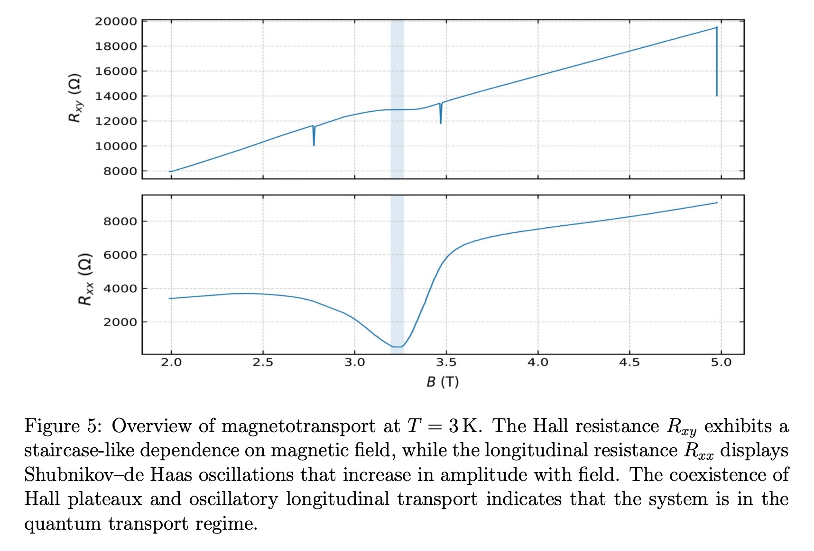

# Observation of the Integer Quantum Hall Effect in a GaAs/AlGaAs Two-Dimensional Electron Gas

**Author:** Frederick Dooley  
**Institution:** School of Physics and Astronomy, University of Nottingham  
**Course:** PHYS3003 — Third Year Experimental Physics Project (Project No. 19)  
**Supervisor:** Dr Chris Mellor  
**Date:** Autumn Semester 2025 — submitted January 2026  

---

## Overview

This repository contains the complete experimental record, data, and analysis
code for a laboratory-scale demonstration of the **integer quantum Hall effect**
(IQHE) in a GaAs/AlGaAs two-dimensional electron gas (2DEG). Magnetotransport
measurements were performed at temperatures between 3 K and 5 K in perpendicular
magnetic fields up to 5 T, revealing the defining signatures of the IQHE: a
quantised Hall resistance plateau at filling factor ν = 2 accompanied by strong
suppression of the longitudinal resistance.

The Hall resistance on the ν = 2 plateau was measured to deviate from the ideal
quantised value h/2e² by only **tens of parts per million**. Carrier densities
extracted from four independent classical and quantum methods agree to within
**0.3%**, demonstrating strong internal consistency of the analysis.

---

## Key Results

| Quantity | Value |
|----------|-------|
| Carrier density n_s | (1.57 ± 0.01) × 10¹⁵ m⁻² |
| Carrier density agreement | ~0.3% across four independent methods |
| Filling factor observed | ν = 2 |
| Plateau centre field B_{ν=2} | (3.23 ± 0.01) T |
| Hall resistance on plateau | (12905.9 ± 0.3) Ω |
| Deviation from h/2e² | Tens of parts per million |
| Carrier mobility μ | (9.5 ± 1.4) × 10⁵ cm² V⁻¹ s⁻¹ |
| Transport lifetime τ_tr | ~3.5 × 10⁻¹¹ s |
| Measurement temperature range | 3 K – 5 K |

---

## The Physics

The **quantum Hall effect** arises in a two-dimensional electron gas subjected
to a strong perpendicular magnetic field at low temperature. Landau quantisation
breaks the continuous energy spectrum into discrete levels separated by
ΔE = ℏω_c = ℏeB/m*. When the Fermi level lies between Landau levels, in a
region of disorder-localised states, the Hall resistance becomes precisely
quantised at R_xy = h/(νe²) while the longitudinal resistance vanishes.

This quantisation is topologically protected and extraordinarily robust —
insensitive to sample geometry and microscopic disorder — which is why it
underpins the international resistance standard for the ohm.

In this experiment, the transition from classical Hall transport (linear R_xy vs B)
to quantised Hall transport is traced through the emergence of
Shubnikov–de Haas oscillations in the longitudinal resistance and the
development of the ν = 2 Hall plateau at higher fields.

---

## Overview Magnetotransport



*Figure 1: Hall resistance R_xy (upper) and longitudinal resistance R_xx (lower)
as functions of perpendicular magnetic field at T = 3 K. The staircase structure
in R_xy and the oscillatory behaviour in R_xx are the defining signatures of the
integer quantum Hall regime. The shaded region marks the ν = 2 plateau window.*

---

## The ν = 2 Hall Plateau


*Figure 2: Deviation of the measured Hall resistance from the ideal quantised
value h/2e² across the ν = 2 plateau, shown for both increasing and decreasing
field sweeps. The close agreement between traces demonstrates reproducibility
and negligible hysteresis. The deviation remains within tens of parts per million
across the plateau window.*

---

## Conductivity Tensor


*Figure 3: Conductivity tensor components σ_xy(B) and σ_xx(B) obtained by
inversion of the resistivity tensor. The low-field region |B| < 0.25 T is
masked due to numerical instability of the inversion near B = 0. Outside this
region, minima in σ_xx coincide with plateaux in σ_xy at integer multiples of
e²/h, consistent with the localisation picture of the integer QHE.*

---

## Carrier Density — Landau Fan Analysis


*Figure 4: Landau fan diagram constructed from Shubnikov–de Haas oscillation
extrema in the longitudinal resistance. The linear relationship between extremum
index n and inverse field 1/B_peak confirms a single well-defined carrier
population. The slope yields n_s independently of the absolute field calibration.*

---

## Temperature Dependence of SdH Oscillations


*Figure 5: Longitudinal voltage V_xx(B) measured at T = 3 K, 4 K, and 5 K.
The monotonic decrease in Shubnikov–de Haas oscillation amplitude with
increasing temperature is consistent with thermal broadening of Landau levels
(Lifshitz–Kosevich damping). The oscillation positions remain unchanged,
confirming that the carrier density is constant across this temperature range.*

---

## Repository Structure

```
QHE-GaAs-2DEG/
│
├── README.md                          — this file
├── .gitignore
├── requirements.txt
│
├── report/
│   └── QHE_Report_Submission.pdf      — full laboratory report (30 pp.)
│
├── diary/
│   └── lab_diary.pdf                  — complete project diary
│
├── data/
│   ├── session1_legacy/               — Session 1 PNG screenshots (no CSVs survive)
│   │   ├── README.md
│   │   └── *.png (8 files)
│   └── session2/                      — Session 2 primary dataset (all CSVs)
│       ├── README_runs.md             — full run log with file descriptions
│       └── QHE_mergedDATA_*.csv
│
├── src/
│   ├── acquisition/
│   │   └── qhe_data_acquisition.py    — real-time instrument control and logging
│   └── analysis/
│       ├── qhe_analysis_pipeline.py   — step-by-step modular analysis
│       └── qhe_final_analysis.py      — definitive one-pass figure export
│
└── figures/
    ├── report_figures/                — main report figures (PNG + PDF)
    └── appendix_figures/              — appendix diagnostic figures
```

---

## Sample

The device studied is a modulation-doped GaAs/AlGaAs heterostructure
two-dimensional electron gas, identified on the MBE growth sheet as
**sample NU1783** (provided by Dr C. Mellor, University of Nottingham).

The layer structure from top to bottom is:

| Layer | Material | Thickness |
|-------|----------|-----------|
| Cap | GaAs | 17 nm |
| Donor layer | n-Al₀.₃₃Ga₀.₆₇As (n = 1.3×10¹⁸ cm⁻³) | 40 nm |
| Spacer | Undoped Al₀.₃₃Ga₀.₆₇As | 40 nm |
| 2DEG | GaAs/AlGaAs interface | — |
| Buffer | GaAs | 500 nm |
| Superlattice | GaAs/Al₀.₃₃Ga₀.₆₇As | 250 nm |
| Buffer | GaAs | 1000 nm |
| Substrate | Semi-insulating GaAs (100) | — |

The device was patterned into a circular Hall-bar geometry with twelve
contacts. The Hall-bar geometry factor W/L = 0.0610 ± 0.0094 was measured
from an optical microscope image using Fiji image analysis software.
The 15.4% relative uncertainty in W/L is the dominant systematic
contribution to the mobility and all ρ_xx-derived quantities.

---

## Experimental Setup

**Cryogenics:** Laboratory helium insert cryostat (DEWAR 01) cooled with
liquid helium. A vacuum leak prevented stable operation below ~3 K;
active thermal stabilisation was used throughout, limiting the base
temperature to approximately 3 K.

**Magnet:** Superconducting solenoid, 0–7 T. Field calibration:
B = 1.3445 × V_B (T/V), where V_B is the power supply monitor voltage.

**Measurement electronics:** Two Stanford Research Systems SR830 lock-in
amplifiers operating at f = 67 Hz with a 1 MΩ series resistor, providing
an excitation current of approximately 0.84 µA. A Keithley 2100 digital
multimeter read the field-proportional monitor voltage. All instruments
communicated via GPIB/USB using PyVISA.

**Contact configuration:** Current injection through pads 2 and 9;
Hall voltage V_xy through pads 5 and 10; longitudinal voltage V_xx
through pads 6 and 4.

**Key instrument correction:** A 5% gain offset was identified on the
upper SR830 (V_xy channel) and corrected uniformly across all datasets
before analysis. See Appendix A.2 of the report.

---

## Code

### `src/acquisition/qhe_data_acquisition.py`
Real-time data acquisition script. Communicates simultaneously with both
SR830 lock-in amplifiers (via GPIB) and the Keithley 2100 multimeter (via
USB) using PyVISA. Logs V_xx, V_xy (X, Y, R, θ for each), and V_B to a
timestamped CSV at 1 s intervals. Displays live matplotlib plots of both
signals against time and against field voltage during acquisition.

Requires instruments connected and a VISA backend installed (NI-VISA was
used). For analysis only, this script is not needed.

### `src/analysis/qhe_analysis_pipeline.py`
Step-by-step modular analysis script organised into four sequential sections:

1. **Carrier density and excitation current** — Hall plateau (Run 4),
   SdH Δ(1/B), and Landau fan (Run 3). Derives I_used from the ν = 2
   plateau anchored to h/2e².
2. **Carrier mobility and transport lifetime** — zero-field R_xx from
   Run 1, sheet resistance, μ and τ_tr via the Drude relation.
3. **Conductivity tensor and plateau quality** — ρ and σ tensor components
   for Runs 3, 4, 5; ppm deviation of R_xy from h/2e².
4. **Temperature dependence** — V_xx overlays and SdH amplitude extraction
   at 3 K, 4 K, 5 K (Runs 3, 6, 7).

Plots are displayed interactively as each section completes.

### `src/analysis/qhe_final_analysis.py`
Definitive one-pass pipeline that reproduces every figure in the submitted
report. All input parameters are frozen in a single `frozen{}` dictionary
at the top of the script. Exports all figures as both PNG (300 dpi) and PDF
to `figures/report_figures/` and `figures/appendix_figures/`.

---

## Reproducing the Results

**1. Install dependencies**
```bash
pip install -r requirements.txt
```

**2. Set the data directory**

In both analysis scripts, set `DATA_DIR` at the top of the file to point
at the Session 2 CSV folder:
```python
DATA_DIR = "data/session2"   # already set correctly if running from repo root
```

**3. Run the step-by-step pipeline** (interactive, plots shown as each
section completes):
```bash
python src/analysis/qhe_analysis_pipeline.py
```

**4. Export all report figures** (one-pass, saves PNG + PDF):
```bash
python src/analysis/qhe_final_analysis.py
```

Figures will be written to `figures/report_figures/` and
`figures/appendix_figures/`.

---

## Known Issues

| Issue | Detail | Effect on results |
|-------|--------|-------------------|
| 5% V_xy gain offset | Upper SR830 configuration setting; corrected uniformly by ×(1/0.95) before all analysis | Corrected — no effect on reported results |
| Cryostat vacuum leak | Prevented stable operation below ~3 K | Restricts temperature range to 3–5 K; reduces visibility of higher ν plateaux |
| Excitation frequency discrepancy | Acquisition script issued FREQ70 (70 Hz) but front panel was set to 67 Hz | No effect on analysis |
| Run 6 filename bug | Some intermediate scripts used `163959.csv` (aborted run) instead of `164654.csv` for Run 6 | Fixed in both final scripts |

---

## Carrier Density Methods

Four independent methods were used to determine n_s, providing a stringent
internal consistency check:

| Method | n_s (×10¹⁵ m⁻²) |
|--------|----------------|
| ν = 2 Hall plateau position | 1.563 ± 0.005 |
| SdH oscillation periodicity Δ(1/B) | 1.574 ± 0.004 |
| Landau fan diagram slope | 1.572 ± 0.003 |
| Low-field Hall slope | 1.562 ± 0.006 |
| **Mean (adopted value)** | **1.57 ± 0.01** |

The maximum fractional spread across all four methods is approximately 0.3%,
confirming that a single well-defined carrier population governs transport
across the full magnetic field range.

---

## References

[1] K. von Klitzing, G. Dorda, and M. Pepper. New method for high-accuracy
determination of the fine-structure constant based on quantized Hall resistance.
*Physical Review Letters*, 45(6):494–497, 1980.

[2] R. B. Laughlin. Quantized Hall conductivity in two dimensions.
*Physical Review B*, 23(10):5632–5633, 1981.

[3] T. Ando, A. B. Fowler, and F. Stern. Electronic properties of two-dimensional
systems. *Reviews of Modern Physics*, 54(2):437–672, 1982.

[4] J. H. Davies. *The Physics of Low-Dimensional Semiconductors.*
Cambridge University Press, 1998.

[5] D. Shoenberg. *Magnetic Oscillations in Metals.*
Cambridge University Press, 1984.

[6] N. W. Ashcroft and N. D. Mermin. *Solid State Physics.*
Holt, Rinehart and Winston, 1976.

[7] R. E. Prange and S. M. Girvin (eds.). *The Quantum Hall Effect.*
Springer, New York, 1987.

[8] B. I. Halperin. Quantized Hall conductance, current-carrying edge states,
and the existence of extended states in a two-dimensional disordered potential.
*Physical Review B*, 25(4):2185–2190, 1982.

[9] M. Büttiker. Absence of backscattering in the quantum Hall effect in
multiprobe conductors. *Physical Review B*, 38(14):9375–9389, 1988.

[10] L. Landau. Diamagnetismus der Metalle.
*Zeitschrift für Physik*, 64:629–637, 1930.

---

## Acknowledgements

Project partner: Christina Mooney, who contributed to the experimental
sessions and early analysis work.

Supervisor: Dr Chris Mellor, School of Physics and Astronomy, University
of Nottingham, who provided the sample, cryogenic apparatus, and guidance
throughout the project.

---

## License

This repository is made available for educational and research reference
purposes. If you use this work, please cite the laboratory report:

> F. Dooley, *Observation of the Integer Quantum Hall Effect in a
> GaAs/AlGaAs Two-Dimensional Electron Gas*, Laboratory Report,
> PHYS3003, University of Nottingham, January 2026.
